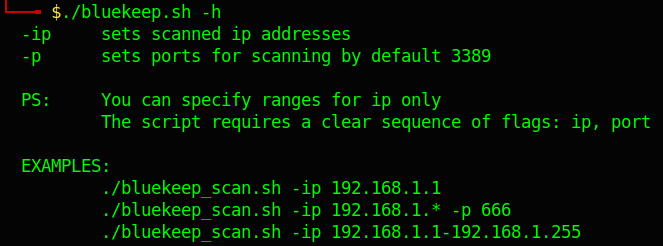
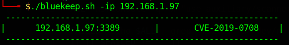
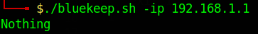

## Как это работает?
Сканирование производится с помощью metasploit.

Сканирование выполняется с целью определения уязвимости хоста к CVE-2019-0708.

На основании результатов сканирования строится таблица.

## Как использовать скрипт

## Результат сканирования

